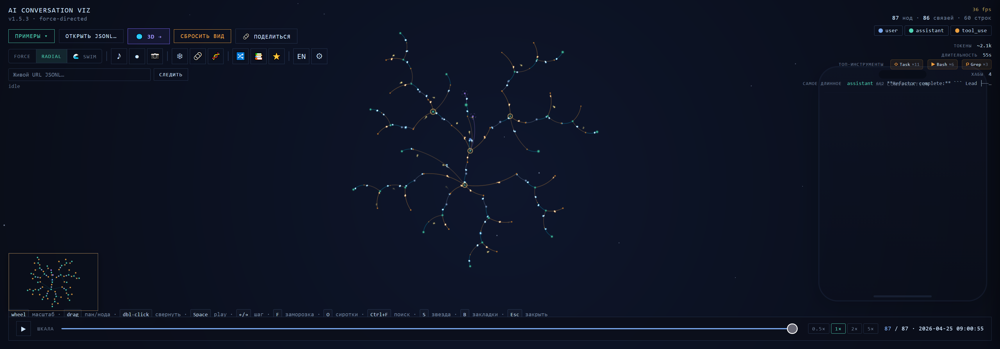
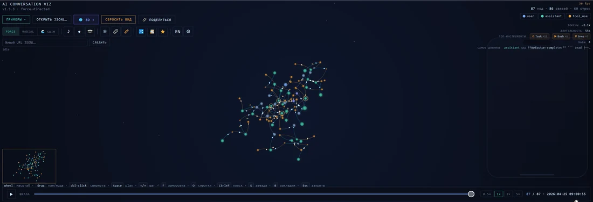

# ai-conversation-viz

> [🇷🇺 Русский](README.ru.md) · 🇬🇧 English

Force-directed visualization of human↔AI conversation sessions, including multi-agent orchestration with Task-tool spawned sub-agents.

[🌐 Live demo](https://andromanpro.github.io/ai-conversation-viz/) · [🌐 3D](https://andromanpro.github.io/ai-conversation-viz/3d.html) · [🤖 Multi-agent demo](https://andromanpro.github.io/ai-conversation-viz/?jsonl=samples/multi-agent-orchestration.jsonl) · [🤖🤖 Deep orchestration](https://andromanpro.github.io/ai-conversation-viz/?jsonl=samples/deep-orchestration.jsonl)



Parses Claude Code JSONL, ChatGPT exports (`conversations.json`) and Anthropic API `messages[]`. Zero dependencies. Canvas 2D primary + WebGL + Three.js 3D alternative. RU / EN interface.

## Features

### Visualization
- **Force-directed layout** with D3-style alpha cooling, Velocity Verlet, adaptive centerPull, leaf-spring boost, soft-wall bounds, Barnes-Hut O(n log n) in 2D
- **3 layout modes** — force, radial sunburst, swim-lanes (time-as-river)
- **3D mode** — Three.js with custom orb shaders (fresnel + specular highlight + breath-pulse), UnrealBloom post-processing, OrbitControls camera + drift, audio
- **Adaptive scale for mega-graphs** — camera frustum / fog / soft-wall expand by `√N`

### Semantic role distinction
- **`user`** — real human input
- **`assistant`** — AI replies
- **`tool_use`** — virtual nodes per tool call (Bash/Grep/Read/Task/…)
- **`tool_result`** — separate role for pure tool returns (was visually identical to `user` until v1.6)
- **`subagent_input`** — Task-tool spawned sub-agent prompts (steel-blue, distinct from human user)
- **`thinking`** — `<thinking>` blocks as virtual children of assistants

### Interaction
- **Timeline playback** — step-by-node with 0.5×/1×/2×/5× speed
- **Phone mockup** — chat renders in iPhone-style bubble with typewriter
- **Drag nodes**, pan/zoom, click details, Ctrl+F search, hover preview (in 3D — toggle in Settings), keyboard shortcuts
- **Hub highlight** (auto-detection of high-degree nodes)
- **Branch collapse** — dbl-click assistant to hide its tool_use children
- **Topics mode** — TF-IDF cluster colors

### Data
- **Multi-agent orchestration** — Task tool calls visualized as sub-agent threads via virtual `#tu<i>` parent links; sub-sub-agents up to N levels
- **Live watch** — polling URL for growing JSONL files
- **Diff mode** — compare two sessions side-by-side
- **Stats** — tokens, duration, top tools, longest, compactions
- **Export** — PNG / SVG snapshot, WebM MediaRecorder
- **Ambient audio** — generative pad + chirp on node birth
- **CLI-meta strip** — removes `<system-reminder>` / `<command-name>` / `<command-message>` from display text
- **Auto performance degrade** at 400+ / 1500+ nodes
- **Share URL** — `?jsonl=<url>&t=<0..100>&n=<nodeId>&hide=<roles>`

## Gallery

### 2D — playback + layout switch




### 3D — orbit + birth animation + layout switch


### Mega-structure — large session in 3D


## Install

```bash
npm install @andromanpro/ai-conversation-viz
```

## Usage (embed)

```js
import { mount, SAMPLE_JSONL } from '@andromanpro/ai-conversation-viz';

const viewer = mount(document.getElementById('viz'), {
  jsonl: SAMPLE_JSONL,     // либо своя строка JSONL / ChatGPT json / Anthropic messages
  width: 800,               // опционально (иначе clientWidth)
  height: 600,
  starfield: true,
  autoFit: true,
});

// API
viewer.loadJsonl(newJsonl);   // заменить данные
viewer.setTimeline(0.5);      // позиция [0..1]
viewer.play();                // от начала
viewer.pause();
viewer.fitView();
viewer.destroy();
viewer.getState();            // низкоуровневый доступ
```

## Usage (full UI standalone)

Двойной клик на `standalone.html` — готовый self-contained offline viewer с полным UI (phone, timeline, search, stats, share, record). Данные подгружаются через «Open JSONL…» или drag-drop.

Или через HTTP:
```bash
npx serve .
# http://localhost:3000/         — 2D
# http://localhost:3000/3d.html  — 3D
```

## Data formats

Распознаются автоматически:
- **Claude Code JSONL** — `{"type":"user|assistant", "uuid", "parentUuid", "message":{"content":[{"type":"text|thinking|tool_use|tool_result|image"}]}}`
- **ChatGPT export** (`conversations.json`) — массив с `mapping: {id: {message, parent, children}}`
- **Anthropic API** — массив `[{role, content}]`

Parser извлекает из каждого message: text, thinking (`💭`), tool_use (имя + key param), tool_result (`↩` или `⚠` при `is_error`), image (`[image]`). Для assistant без текста генерируется summary `🔧 Grep "pattern" · Bash "cmd" · …`.

## Keyboard shortcuts

| Key | Action |
|---|---|
| `Space` | Play / Pause |
| `←` / `→` | Step back / forward |
| `Home` / `R` | Fit view |
| `Ctrl+F` | Search |
| `F` | Freeze physics |
| `O` | Toggle orphan connect |
| `1/2/3/5` | Speed 0.5× / 1× / 2× / 5× |
| `Esc` | Close detail / search |
| Dbl-click node | Collapse / expand tool_use children |

## Build

```bash
npm run build    # → dist/ai-conversation-viz.js (IIFE, ~370 KB)
npm run test     # 147 unit tests
npm run sonar    # SonarQube scan (host/token via SONAR_HOST_URL + SONAR_TOKEN env)
```

## Architecture

```
src/
├─ core/
│  ├─ config.js        — все настройки (CFG + COLORS)
│  ├─ parser.js        — parseJSONL, parseLine, classifyContent
│  ├─ adapters.js      — detect + ChatGPT/Anthropic → Claude JSONL
│  ├─ graph.js         — buildGraph, appendRawNodes, degree/hub
│  ├─ layout.js        — stepPhysics (sim), radial, swim, fitToView
│  ├─ quadtree.js      — Barnes-Hut O(n log n) repulsion
│  ├─ tree.js          — computeDepths (BFS)
│  └─ sample.js        — demo JSONL
├─ view/
│  ├─ state.js         — общий mutable state
│  ├─ camera.js        — world↔screen
│  ├─ renderer.js      — canvas 2D draw + birth-animation
│  ├─ particles.js     — electric sparks по рёбрам
│  ├─ starfield.js     — parallax звёзды
│  ├─ path.js          — pathToRoot (hover highlight)
│  └─ tool-icons.js    — юникод-иконки по имени тула
├─ ui/
│  ├─ loader.js        — load/drop/URL → normalize → buildGraph
│  ├─ interaction.js   — mouse/wheel events
│  ├─ timeline.js      — step-by-node play + speed
│  ├─ story-mode.js    — phone + typewriter + queue
│  ├─ search.js        — Ctrl+F
│  ├─ live.js          — polling growing JSONL URL
│  ├─ detail-panel.js  — click-info
│  ├─ tooltip.js       — hover preview
│  ├─ filter.js        — role toggle
│  ├─ minimap.js       — corner map + click-teleport
│  ├─ stats-hud.js     — tokens/duration/tools/hubs
│  ├─ share.js         — Share URL
│  ├─ layout-toggle.js — force/radial/swim chips
│  ├─ freeze-toggle.js — ❄ Freeze button
│  ├─ speed-control.js — play speed chips
│  ├─ audio.js         — generative ambient + chirp
│  ├─ recorder.js      — MediaRecorder WebM
│  ├─ snapshot.js      — PNG / SVG
│  ├─ orphans-toggle.js— 🔗 Connect orphans
│  └─ keyboard.js      — global shortcuts
├─ 3d/
│  └─ main.js          — Three.js сцена, raycaster, phone
├─ main.js             — 2D entrypoint
└─ embed.js            — npm entry (programmatic mount)
```

## License

MIT
